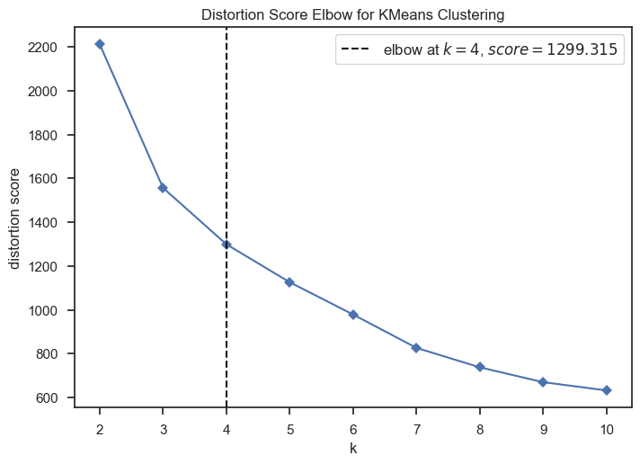
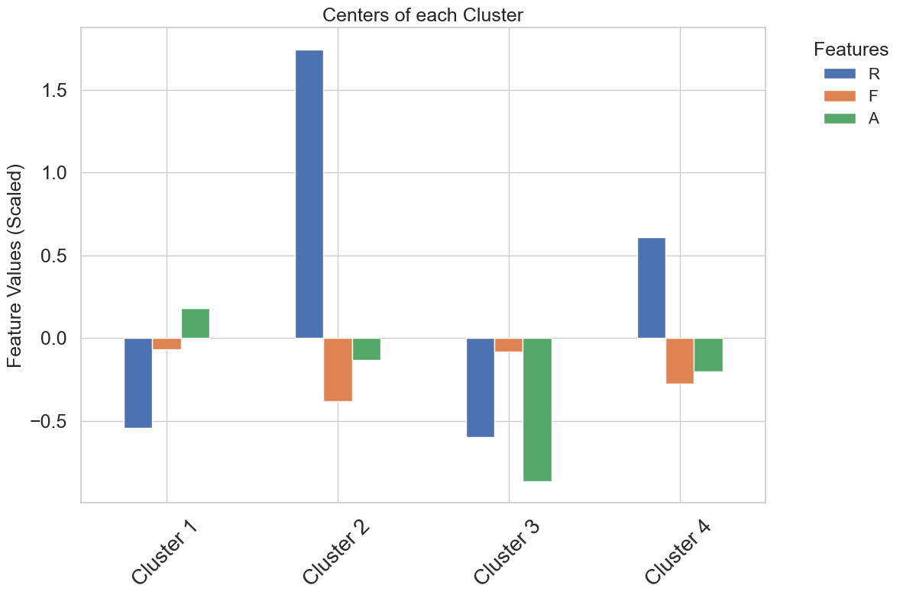
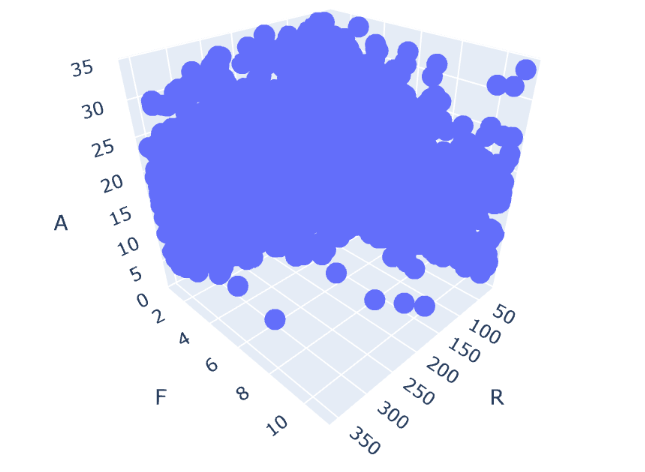
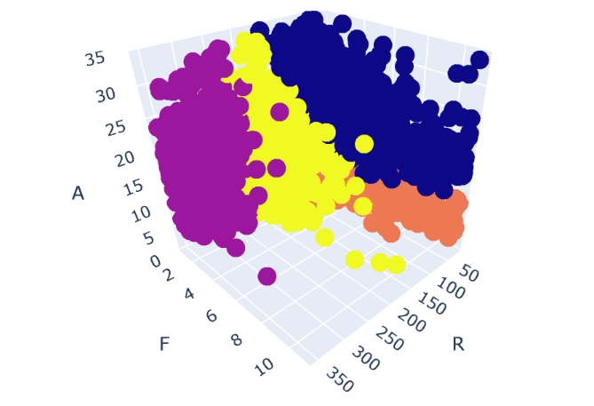

# E-commerce Customer Segmentation using Clustering

## Overview
This project aims to segment e-commerce customers using **K-means clustering**. The original dataset contains raw transactional data from an e-commerce platform, which was transformed into Recency, Frequency, and Average Monetary Value (RFA) metrics. By clustering customers based on these metrics, businesses can develop targeted marketing strategies to improve engagement and optimize sales.

The project follows the **CRISP-DM** (Cross-Industry Standard Process for Data Mining) methodology, ensuring a structured and data-driven approach.

The K-means algorithm identified **4 customer segments**, each with unique characteristics:

- **Cluster 1**: Most valuable customers, showing high spending potential. Focus on retention and relationship building.
- **Cluster 2**: Inactive customers with low engagement. Reactivation campaigns are necessary to bring them back.
- **Cluster 3**: Engaged customers with very low spending. Focus on increasing average transaction value.
- **Cluster 4**: Somewhat inactive customers with low purchase value. Improve experience and provide personalized incentives to re-engage them.

## Objective
The goal is to identify customer segments based on purchasing behaviors such as how recently they made a purchase, how often they purchase, and how much they spend on average. These clusters will assist in creating personalized marketing strategies, leading to improved customer retention, engagement, and increased sales.

## Dataset
The dataset comes from [Kaggle](https://www.kaggle.com/datasets/carrie1/ecommerce-data) and contains transactions of an e-commerce store. Features include:
- `InvoiceNo`: Unique transaction code.
- `StockCode`: Product identifier.
- `Description`: Product description.
- `Quantity`: Number of items purchased.
- `InvoiceDate`: Date of the transaction.
- `UnitPrice`: Price per item.
- `CustomerID`: Unique identifier for each customer.
- `Country`: Customer’s country.

The dataset was processed to create the following RFA metrics for each customer:
- **Recency (R)**: Days since the last purchase.
- **Frequency (F)**: Number of purchases during the observation period.
- **Average Monetary Value (A)**: Average amount spent by the customer.

## Methodology: CRISP-DM

1. **Business Understanding**: 
   - Segment customers based on their purchasing behavior to optimize marketing efforts.
   - Develop tailored strategies for each segment based on their engagement and spending patterns.

2. **Data Understanding**:
   - Analyze the original e-commerce transaction dataset to gain insights into customer behavior.

3. **Data Preparation**:
   - Handle missing values, outliers, and duplicates in the transactional data.
   - **RFA Calculation**: Transform the raw transactional data into Recency, Frequency, and Average Monetary Value (RFA) metrics for each customer.
   - Normalize RFA values to standardize the data for clustering.

4. **Modeling**:
   - Apply **K-means clustering** to group customers based on their RFA metrics.
   - Evaluate the optimal number of clusters using the Elbow method, Silhouette Score, and other metrics like Calinski-Harabasz and Davies-Bouldin scores.

5. **Evaluation**:
   - Interpret cluster centers to identify distinct customer profiles.
   - Develop strategic actions for each cluster based on their behavior.

6. **Deployment**:
   - Results can be leveraged to drive targeted marketing campaigns, improve retention, and personalize offers.

## Clustering Results
The K-means algorithm identified **4 customer segments**, each with unique characteristics:

  
  

### Cluster Profiles and Actions

| Cluster | Recency (R) | Frequency (F) | Average Monetary Value (A) | Profile Description | Suggested Actions |
|---------|-------------|---------------|----------------------------|---------------------|-------------------|
| Cluster_1  | -0.542 | -0.066 | 0.182 | Recent, Average Frequency, High Value | Loyalty programs, Cross-selling, and Upselling |
| Cluster_2  | 1.746 | -0.382 | -0.133 | Inactive, Low Frequency, Low Value | Reactivation campaigns, Personalized offers |
| Cluster_3  | -0.599 | -0.079 | -0.862 | Recent, Average Frequency, Very Low Value | Upselling, Incentives to increase spending |
| Cluster_4  | 0.608 | -0.276 | -0.202 | Somewhat inactive, Low Frequency, Low Value | Re-engagement campaigns, Improving customer experience |

  
  

### Example of Strategic Action for Cluster 1:
**Profile**: Recent buyers with average purchase frequency and high spending.  
**Actions**:
- **Loyalty Programs**: Encourage repeat purchases by offering exclusive rewards.
- **Cross-Selling/Up-Selling**: Suggest related or higher-value products to increase basket size.
- **Engagement Campaigns**: Maintain customer interest with personalized offers and content.

## Technologies Used
- **Python**: For data preprocessing, modeling, and visualization.
- **Libraries**: 
  - `pandas`, `numpy`: Data manipulation and analysis.
  - `scikit-learn`: Clustering algorithm and evaluation metrics.
  - `matplotlib`, `seaborn`, `pyplot`: Data visualization.

## How to Run the Project
1. Clone the repository.
2. Install the necessary Python libraries listed in `requirements.txt`.
3. Run the Jupyter notebook or Python script to replicate the analysis.

## Future Improvements
- Add customer demographic data for more refined segmentation.
- Experiment with alternative clustering algorithms like DBSCAN or hierarchical clustering.
- Integrate real-time deployment to continuously update clusters and marketing strategies.